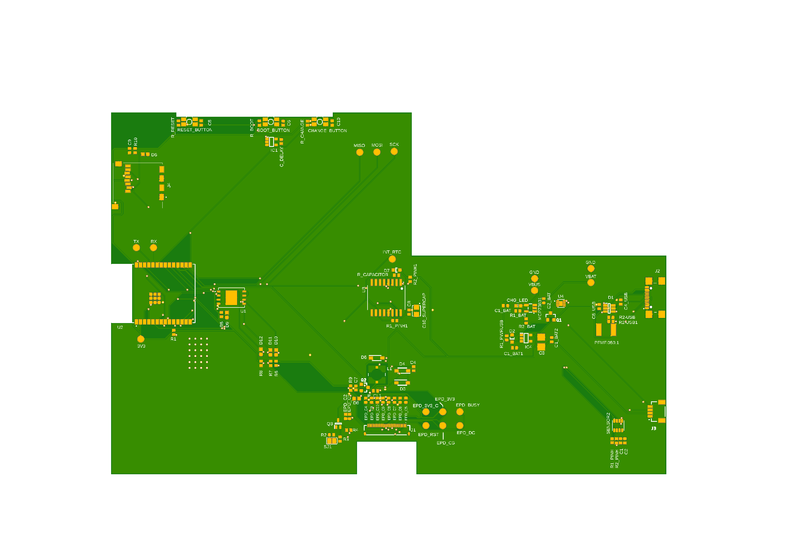
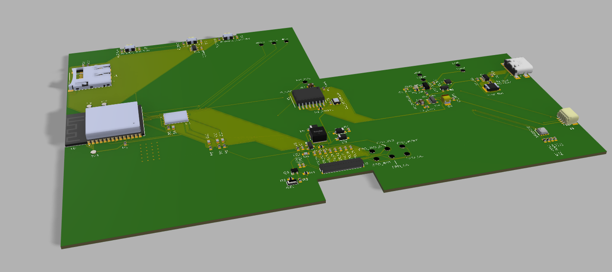

# OpenBook

## 1. Diagrama Bloc

## 2. BOM
|DEVICE                                                  |PARTS                                                                                                  |PURCHASE URL                                                                                                                                      |DATASHEET URL                                                                                                                                     |
|--------------------------------------------------------|-------------------------------------------------------------------------------------------------------|--------------------------------------------------------------------------------------------------------------------------------------------------|--------------------------------------------------------------------------------------------------------------------------------------------------|
|ADAFRUIT_LEDCHIP-LED0603                                |CHG_LED                                                                                                |https://www.tme.eu/en/details/kp-1608surck/smd-colour-leds/kingbright-electronic/                                                                 |https://www.alldatasheet.com/datasheet-pdf/pdf/1153370/TO-GRACE/KP-1608SURCK.html                                                                 |
|EAGLE-LTSPICE_C                                         |EPD_C5                                                                                                 |https://www.digikey.com/en/products/detail/samsung-electro-mechanics/CL05B104KB5NNNC/11696318                                                     |https://www.digikey.com/en/products/detail/samsung-electro-mechanics/CL05B104KB5NNNC/11696318                                                     |
|ESP32_WROVER_EAGLE-LTSPICE_R                            |R3                                                                                                     |https://www.digikey.com/en/products/detail/cts-resistor-products/73L1R47J/1543472                                                                 |https://www.digikey.com/en/products/detail/cts-resistor-products/73L1R47J/1543472                                                                 |
|ESP32_WROVER_EAGLE-LTSPICE_R                            |R1_PWRUSB                                                                                              |https://www.digikey.com/en/products/detail/yageo/RC0402JR-07100KL/726416                                                                          |https://www.digikey.com/en/products/detail/yageo/RC0402JR-07100KL/726416                                                                          |
|EAGLE-LTSPICE_C                                         |C1, C2, C4_USB, C6, C8, C9, C10, C_DELAY                                                               |https://www.digikey.com/en/products/detail/samsung-electro-mechanics/CL05B104KP5NNNC/3886660                                                      |https://www.digikey.com/en/products/detail/samsung-electro-mechanics/CL05B104KP5NNNC/3886660                                                      |
|RCL_CPOL-EUCT3528                                       |C3                                                                                                     |https://ro.mouser.com/ProductDetail/KEMET/T491B107K006AT?qs=0CYHZL%252BGkuR7Fv7IsnkA2g%3D%3D                                                      |https://ro.mouser.com/ProductDetail/KEMET/T491B107K006AT?qs=0CYHZL%252BGkuR7Fv7IsnkA2g%3D%3D                                                      |
|ESP32_WROVER_EAGLE-LTSPICE_R                            |R1, R1_PINH, R1_PINH1, R2_PINH, R2_PINH1, R4, R5, R6, R7, R8, R9, R10, R_BOOT, R_CHANGE, R_CL1, R_RESET|https://www.digikey.com/en/products/detail/yageo/RC0402JR-0710KL/726418                                                                           |https://www.digikey.com/en/products/detail/yageo/RC0402JR-0710KL/726418                                                                           |
|EAGLE-LTSPICE_C                                         |C7                                                                                                     |https://www.digikey.com/en/products/detail/samsung-electro-mechanics/CL05A106MP5NUNC/3887108                                                      |https://www.digikey.com/en/products/detail/samsung-electro-mechanics/CL05A106MP5NUNC/3887108                                                      |
|112A-TAAR-R03_ATTEND                                    |J4                                                                                                     |https://www.digikey.com/en/products/detail/attend-technology/112A-TAAR-R03/17633923?s=N4IgTCBcDaIIxzAQQLQBUlIEoqwBgGYQBdAXyA                      |https://www.digikey.com/en/products/detail/attend-technology/112A-TAAR-R03/17633923?s=N4IgTCBcDaIIxzAQQLQBUlIEoqwBgGYQBdAXyA                      |
|ESP32_WROVER_EAGLE-LTSPICE_R                            |R_CAPACITOR                                                                                            |https://www.digikey.com/en/products/detail/te-connectivity-passive-product/CRGCQ0402F15R/8576207                                                  |https://www.digikey.com/en/products/detail/te-connectivity-passive-product/CRGCQ0402F15R/8576207                                                  |
|EAGLE-LTSPICE_C                                         |C5                                                                                                     |https://www.digikey.com/en/products/detail/taiyo-yuden/JMK105BJ105KV-F/930583                                                                     |https://www.digikey.com/en/products/detail/taiyo-yuden/JMK105BJ105KV-F/930583                                                                     |
|EAGLE-LTSPICE_C                                         |EPD_C1, EPD_C2, EPD_C3, EPD_C4, EPD_C6, EPD_C7, EPD_C8, EPD_C9, EPD_C10                                |https://www.digikey.com/en/products/detail/murata-electronics/GRM155R61H105KE05D/13531808                                                         |https://www.digikey.com/en/products/detail/murata-electronics/GRM155R61H105KE05D/13531808                                                         |
|ESP32_WROVER_EAGLE-LTSPICE_R                            |R2                                                                                                     |https://www.digikey.com/en/products/detail/stackpole-electronics-inc/RMCF0402FT2R20/4376617                                                       |https://www.digikey.com/en/products/detail/stackpole-electronics-inc/RMCF0402FT2R20/4376617                                                       |
|ESP32_WROVER_EAGLE-LTSPICE_R                            |R1_BAT                                                                                                 |https://www.digikey.com/en/products/detail/panasonic-electronic-components/ERJ-2RKF2000X/192215                                                   |https://www.digikey.com/en/products/detail/panasonic-electronic-components/ERJ-2RKF2000X/192215                                                   |
|ESP32_WROVER_SPARKFUN-DISCRETESEMI_MOSFET_PCH           |Q1, Q2                                                                                                 |https://ro.mouser.com/ProductDetail/Diodes-Incorporated/DMG2305UXQ-7?qs=60RJRzIpcl%2FUiAojHt1c9w%3D%3D                                            |https://ro.mouser.com/ProductDetail/Diodes-Incorporated/DMG2305UXQ-7?qs=60RJRzIpcl%2FUiAojHt1c9w%3D%3D                                            |
|ESP32_WROVER_EAGLE-LTSPICE_R                            |R2_BAT                                                                                                 |https://www.digikey.com/en/products/detail/panasonic-electronic-components/ERJ-2RKF2001X/192194                                                   |https://www.digikey.com/en/products/detail/panasonic-electronic-components/ERJ-2RKF2001X/192194                                                   |
|EAGLE-LTSPICE_C                                         |C1_BAT, C1_BAT1, C1_BAT2, C2_BAT, C5_USB                                                               |https://www.digikey.com/en/products/detail/samsung-electro-mechanics/CL05A475KQ5NRNC/3887139                                                      |https://www.digikey.com/en/products/detail/samsung-electro-mechanics/CL05A475KQ5NRNC/3887139                                                      |
|EAGLE-LTSPICE_C                                         |C4                                                                                                     |https://www.digikey.com/en/products/detail/murata-electronics/GRM155C61E475ME15D/16821133                                                         |https://www.digikey.com/en/products/detail/murata-electronics/GRM155C61E475ME15D/16821133                                                         |
|ESP32_WROVER_EAGLE-LTSPICE_R                            |R2-USB, R2-USB1                                                                                        |https://www.digikey.com/en/products/detail/panasonic-electronic-components/ERA-2AEB512X/1706022                                                   |https://www.digikey.com/en/products/detail/panasonic-electronic-components/ERA-2AEB512X/1706022                                                   |
|744043680IND_4828-WE-TPC_WRE                            |L1                                                                                                     |https://www.digikey.com/en/products/detail/w%C3%BCrth-elektronik/744043680/1638515?s=N4IgTCBcDaIOwBYEAYEGYBsAOZIC6AvkA                            |https://www.digikey.com/en/products/detail/w%C3%BCrth-elektronik/744043680/1638515?s=N4IgTCBcDaIOwBYEAYEGYBsAOZIC6AvkA                            |
|BD5229G-TR                                              |IC1                                                                                                    |https://www.digikey.com/en/products/detail/rohm-semiconductor/BD5229G-TR/658502?s=N4IgTCBcDaIEIBECsYwE4DiBaAKgJRAF0BfIA                           |https://www.digikey.com/en/products/detail/rohm-semiconductor/BD5229G-TR/658502?s=N4IgTCBcDaIEIBECsYwE4DiBaAKgJRAF0BfIA                           |
|ESP32_WROVER_BME680_BME680                              |SENSOR2                                                                                                |https://www.digikey.com/en/products/detail/bosch-sensortec/BME680/7401317                                                                         |https://www.digikey.com/en/products/detail/bosch-sensortec/BME680/7401317                                                                         |
|BUTTON_CUSYOMV1.                                        |BOOT_BUTTON, CHANGE_BUTTON, RESET_BUTTON                                                               |https://www.digikey.com/en/products/detail/c-k/KMS221G-LFS/2043218?s=N4IgTCBcDaINIFkDKYwEYDiAZAYkkAugL5A                                          |https://www.digikey.com/en/products/detail/c-k/KMS221G-LFS/2043218?s=N4IgTCBcDaINIFkDKYwEYDiAZAYkkAugL5A                                          |
|CPH3225A                                                |C10_SUPERCAP                                                                                           |https://www.snapeda.com/api/url_track_click_mouser/?unipart_id=562593&manufacturer=Seiko Instruments&part_name=CPH3225A&search_term=None          |https://www.snapeda.com/api/url_track_click_mouser/?unipart_id=562593&manufacturer=Seiko Instruments&part_name=CPH3225A&search_term=None          |
|DS3231SN#                                               |U3                                                                                                     |https://www.snapeda.com/api/url_track_click_mouser/?unipart_id=99048&manufacturer=Analog Devices&part_name=DS3231SN#&search_term=None             |https://www.snapeda.com/api/url_track_click_mouser/?unipart_id=99048&manufacturer=Analog Devices&part_name=DS3231SN#&search_term=None             |
|ESP32-C6-WROOM-1-N8                                     |U2                                                                                                     |https://www.digikey.com/en/products/detail/espressif-systems/ESP32-C6-WROOM-1-N8/17728866?s=N4IgTCBcDaIKIGUAKBmMBaAwgNnQdQCUB5IgWXQEZ0A5ADhAF0BfIA|https://www.digikey.com/en/products/detail/espressif-systems/ESP32-C6-WROOM-1-N8/17728866?s=N4IgTCBcDaIKIGUAKBmMBaAwgNnQdQCUB5IgWXQEZ0A5ADhAF0BfIA|
|ESP32C6_VARISTORCN1812                                  |PFMF.050.1                                                                                             |https://www.digikey.com/en/products/detail/epcos-tdk-electronics/B72580T0400K062/4945372                                                          |https://www.digikey.com/en/products/detail/epcos-tdk-electronics/B72580T0400K062/4945372                                                          |
|ESP32_WROVER_AVX---SD0805S020S1R0_AVX_SD0805S020S1R0_0_0|D2                                                                                                     |https://www.digikey.com/en/products/detail/kyocera-avx/SD0805S020S1R0/3749517?s=N4IgTCBcDaIMoBEAMAOJBWOSxLgRgCUkQBdAXyA                           |https://www.digikey.com/en/products/detail/kyocera-avx/SD0805S020S1R0/3749517?s=N4IgTCBcDaIMoBEAMAOJBWOSxLgRgCUkQBdAXyA                           |
|ESP32_WROVER_SPARKFUN-IC-POWER_MCP73831                 |MCP73831                                                                                               |https://www.digikey.com/en/products/detail/microchip-technology/MCP73831T-2ACI-OT/964301                                                          |https://www.digikey.com/en/products/detail/microchip-technology/MCP73831T-2ACI-OT/964301                                                          |
|FH34SRJ-24S-0.5SH_99_                                   |J1                                                                                                     |https://www.digikey.com/en/products/detail/hirose-electric-co-ltd/fh34srj-24s-0-5sh-99/5132529                                                    |https://www.digikey.com/en/products/detail/hirose-electric-co-ltd/fh34srj-24s-0-5sh-99/5132529                                                    |
|MAX17048G+T10                                           |U4                                                                                                     |https://www.snapeda.com/api/url_track_click_mouser/?unipart_id=329239&manufacturer=Analog Devices&part_name=MAX17048G+T10&search_term=None        |https://www.digikey.com/en/products/detail/analog-devices-inc-maxim-integrated/max17048g-t10/3758921                                              |
|MBR0530.                                                |D3, D4, D5                                                                                             |https://www.digikey.com/en/products/detail/smc-diode-solutions/MBR0530/16692306                                                                   |https://www.digikey.com/en/products/detail/smc-diode-solutions/MBR0530/16692306                                                                   |
|PGB1010603MR.                                           |D6, D8, D9, D10, D11, D12                                                                              |https://www.digikey.com/en/products/detail/littelfuse-inc/PGB1010603MR/715755                                                                     |https://www.digikey.com/en/products/detail/littelfuse-inc/PGB1010603MR/715755                                                                     |
|QWIIC_CONNECTORJS-1MM                                   |J3                                                                                                     |https://www.digikey.lt/en/products/detail/jst-sales-america-inc/SM04B-SRSS-TB/926710                                                              |https://www.digikey.lt/en/products/detail/jst-sales-america-inc/SM04B-SRSS-TB/926710                                                              |
|SAMACSYS_PARTS_USB4110-GF-A                             |J2                                                                                                     |https://www.digikey.lt/en/products/detail/gct/usb4110-gf-a/10384547                                                                               |https://www.digikey.lt/en/products/detail/gct/usb4110-gf-a/10384547                                                                               |
|ESP32_WROVER_AVX---SD0805S020S1R0_AVX_SD0805S020S1R0_0_0|D7                                                                                                     |https://www.digikey.lt/en/products/detail/kyocera-avx/sd0805s020s1r0/3749517                                                                      |https://www.digikey.lt/en/products/detail/kyocera-avx/sd0805s020s1r0/3749517                                                                      |
|SI1308EDL-T1-GE3                                        |Q3                                                                                                     |https://www.digikey.lt/en/products/detail/vishay-siliconix/si1308edl-t1-ge3/4876435                                                               |https://www.digikey.lt/en/products/detail/vishay-siliconix/si1308edl-t1-ge3/4876435                                                               |
|USBLC6-2SC6Y                                            |D1                                                                                                     |https://www.digikey.lt/en/products/detail/stmicroelectronics/usblc6-2sc6y/2819177                                                                 |https://www.digikey.lt/en/products/detail/stmicroelectronics/usblc6-2sc6y/2819177                                                                 |
|W25Q512JVEIQ                                            |U1                                                                                                     |https://www.digikey.lt/en/products/detail/winbond-electronics/w25q512jveiq/10244706                                                               |https://www.digikey.lt/en/products/detail/winbond-electronics/w25q512jveiq/10244706                                                               |
|XC6220A331MR-G                                          |IC4                                                                                                    |https://www.digikey.lt/en/products/detail/torex-semiconductor-ltd/xc6220a331mr-g/10165775                                                         |https://www.digikey.lt/en/products/detail/torex-semiconductor-ltd/xc6220a331mr-g/10165775                                                         |
|TP                                                      |TP1, TP2, TP3, TP4, TP5, TP6, TP7, TP8, TP9, TP10, TP11, TP12, TP13, TP14, TP15, TP16, TP17            |                                                                                                                                                  |                                                                                                                                                  |
|SJ                                                      |SJ1                                                                                                    |                                                                                                                                                  |                                                                                                                                                  |

## 3. Descrierea în detaliu a funcționalității hardware
| Nume       | Descriere                                                                  | Pini comunicare ESP32-C6     | Comunicare     |
|------------------------|-------------------------------------------------------------------------------|---------------------------|----------------|
| ESP32-C6-WROOM-1       | MCU RISC-V pe 32 de biți la 160MHz, cu memorie SRAM de 512KB + 16KB și flash extern de 8MB                                                    | USB 2.0, SPI, I2C, UART, GPIO | -              |
| 7.5" e-Paper Display   | E-Paper de 7.5 inch, 800x480 pixeli, alb-negru, cu contrast 8:1, refresh rapid (sub 1s)                                             | SPI + CS, DC, RST, BUSY   | SPI            |
| BME688 Sensor          | Senzor  pentru temperatură, umiditate, presiune și calitatea aerului                                  | SDA, SCL       | I2C            |
| MAX17048 Fuel Gauge    | Gestionare baterie                                                         | I2C                       | I2C            |
| MCP73831 Charger       | Gestionare baterie                                                               | GPIO for control          | GPIO           |
| Buttons        | Butoane fizice tactile cu debouncing hardware prin filtre RC                                              | 3x GPIOs                  | GPIO           |
| USB-C Connector        | Pentru încărcare și transfer de date USB 2.0, cu protecție ESD și posibil suport pentru Power Delivery                                  | USB-D+/D- (native USB)    | USB            |
| SD Card Connector      | Pentru memorie                                                              | - | SPI     |
| DS3231 RTC             | Ceas Real Time                                          | I2C                       | I2C            |
| Qwiic/Stemma Connector | Expansiune conector senzori                                               | I2C                | I2C            |
| LDO Voltage Regulator  | Genereaza o singură șină de alimentare de 3.3V                                             | -                         | -          |
| Baterie (2500mAh)      | Baterie Li-Polimer de 2500mAh, 3.7V. Consum redus în deep sleep (sub 50µA) și alimentare de 3.3V pentru sistem                                                  | -                         | -          |

## 4. Asezarea componentelor in carcasa

* PCB-ul are o grosime de 1mm si este sprijinit de capacul carcasei
* Bateria este sprijinita de capacul carcasei
* Ecranul este sprijinit de spatele PCB-ului

## Pasi de implementare
1. Am realizat schematicul cu ajutor componentelor din libraria data si schematicul model.
2. De la schematic am generat PCB-ul 2D. Am adaugat componentele pe PCB conform schemei date.
3. Am facut un nou net class pentru liniile de putere (SupplyNets) si am adaugat liniile corespunzatoare. Am facut o regula speciala pentru grosimea acestor linii (0.3mm).
4. Am rutat manual liniile de putere pentru a ma asigura ca nu folosesc vias-uri prea multe (a fost necesar sa folosesc vias-uri o singura data). Am facut apoi autorutarea.
5. Am adaugat planurile de masa si via stiches.
6. Am adaugat pentru fiecare componenta un model 3D.
7. Am modelat bateria si ecranul conform datasheetului si le-am asamblat in carcasa.

## 5. Decizii

* Eroare SMD-Hole (Samacsys-Parts): Am rezolvat mutand gaurile cu 0.1 mm.

* Eroare Copper width SMD (Net Class: SupplyLines): Am modificat pad-urile de la bobina (Ind_4828) sa fie mai mari (0.5 x 0.5 mm) ca sa permita conectarea cu liniile de putere.

* Eroare Copper width SMD (Net Class: SupplyLines): Am modificat pad-urile de la SON50P200X sa fie mai mari (de la 0.27 mm la 0.3 mm) ca sa permita conectarea cu liniile de putere (VBAT).

* Am aprobat erorile de Power Pin ... connected to ... din Schematic.

## Imagini PCB

